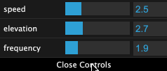
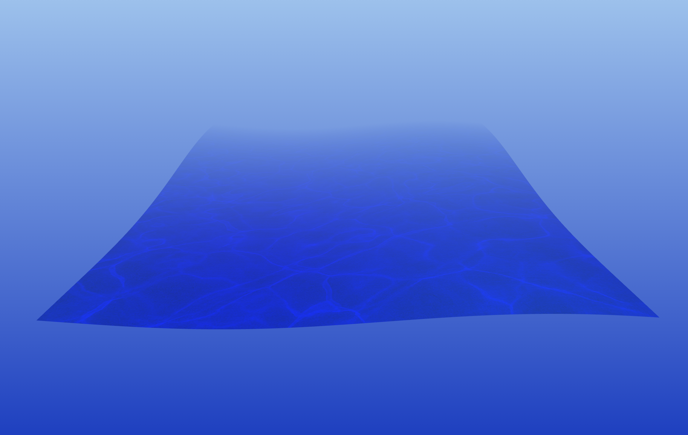
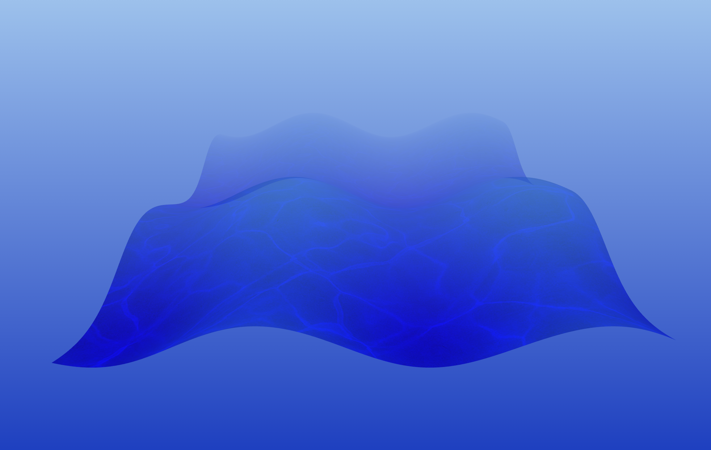

# Antho parle web - Three JS Init


## Preview


## Installation

Run this command in the terminal to install dependencies :

```
yarn
```

Compile the code with a local server (during dev).

```
yarn dev
```

## How to use it ?

#### You can tweak the waves's speed, elevation and frequency as you want using `dat.gui`





## Source

https://github.com/BenjaminRochez/awwwards-webgl-barbajs/tree/5-Fragment-Shaders
